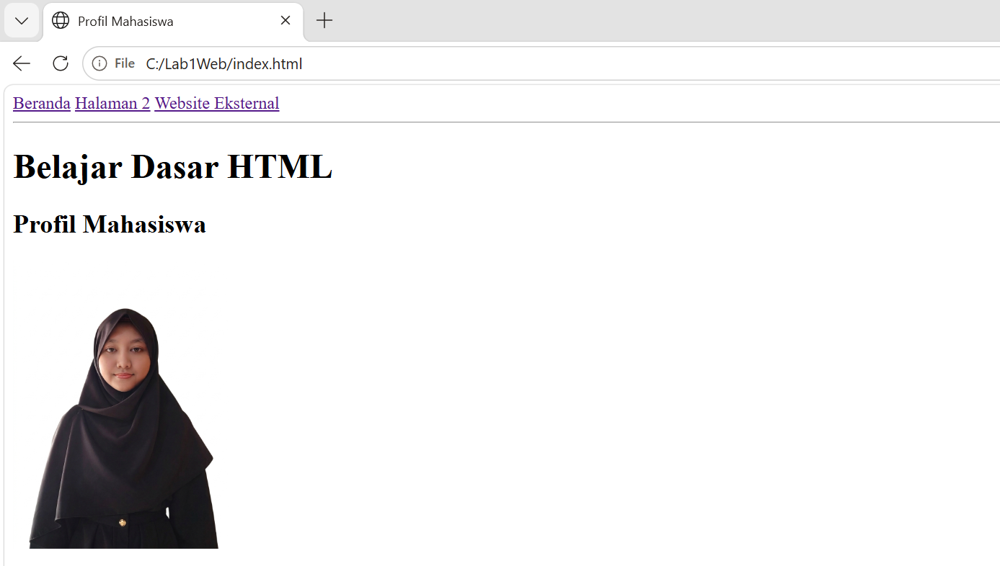
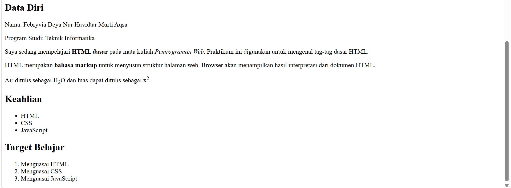
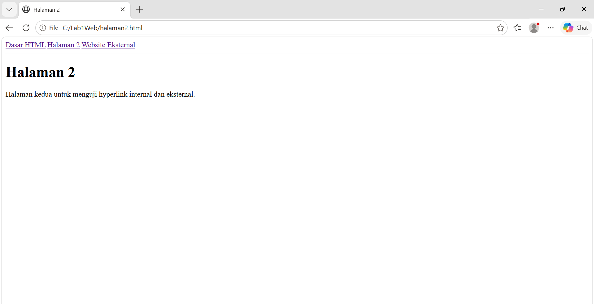
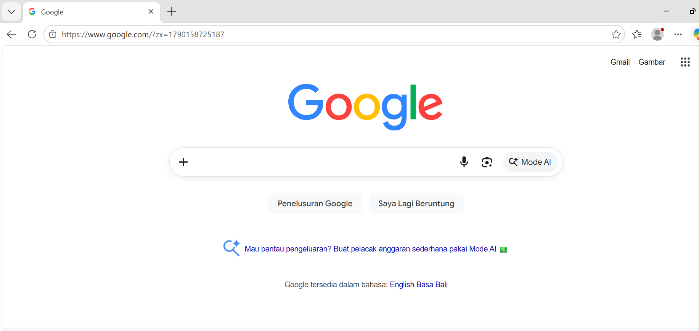

# Praktikum 1: HTML Dasar

Nama: Febryvia Deya Nur Havidtar Murti Aqsa

NIM: 312510194

Mata Kuliah: Pemrograman Web

Kelas: I251B

## Deskripsi
Repository berisi hasil praktikum HTML Dasar, meliputi struktur dokumen,
heading, paragraf, pemformatan teks, gambar, hyperlink, list, dan komentar HTML.

## Langkah-langkah yang Dikerjakan

1. **Struktur Dasar HTML** : Membuat file `index.html` dengan struktur `<!DOCTYPE html>`, `<head>`, dan `<body>`.
2. **Membuat Paragraf** : Menambahkan dua paragraf berisi penjelasan tentang HTML.
3. **Menambahkan Judul** : Menambahkan heading `<h1>` dan `<h2>`.
4. **Memformat Teks** : Menggunakan tag `<b>`, `<i>`, `<strong>`, `<sub>`, `<sup>`.
5. **Menyisipkan Gambar** : Menambahkan gambar profil dengan tag `` di folder `images/`.
6. **Mengatur Ukuran Gambar** : Mengatur atribut `width` pada gambar.
7. **Menambahkan Hyperlink** : Membuat `halaman2.html` dan menghubungkannya dengan `<nav>` dan tag `<a>`.
8. **Menambahkan List** : Membuat unordered list (`<ul>`) untuk keahlian dan ordered list (`<ol>`) untuk target belajar.
9. **Menambahkan Komentar** : Menambahkan komentar `<!-- ... -->` sebagai penanda bagian kode.
10. **Menggabungkan Semua Elemen** : Menggabungkan semua elemen menjadi satu halaman Profil Mahasiswa (`index.html`).

## Screenshot






## Struktur Folder

```
Lab1Web/
├── index.html
├── halaman2.html
├── README.md
├── images/
│   └── profil.jpg
└── screenshots/
    ├── image-01.png
    ├── image-02.png
    ├── image-03.png
    └── image-04.png
```


## Jawaban Pertanyaan

1. Apa fungsi deklarasi `<!DOCTYPE html>` pada dokumen HTML?
Jawaban: Mendeklarasikan bahwa dokumen menggunakan standar HTML5, deklarasi dapat ditulis di bagian paling awal dokumen HTML.

2. Apa perbedaan antara tag, elemen, dan atribut pada HTML?
Jawaban: Tag adalah penanda pembuka dan penutup dari sebuah elemen, contohnya `<p>`. Elemen adalah gabungan dari tag pembuka, isi, dan tag penutup. Atribut adalah informasi tambahan yang ditulis pada tag pembuka, contohnya `href` dan `src`.

3. Apa perbedaan `<p>` dengan `<br>`? Jelaskan penggunaannya.
Jawaban: `<p>` digunakan untuk membuat paragraf baru dan otomatis memberi jarak atau margin antar paragraf. `<br>` hanya memindahkan teks ke baris baru tanpa membuat paragraf baru dan tanpa jarak tambahan.

4. Apa fungsi atribut `href` pada tag `<a>`?
Jawaban: Menentukan URL atau tujuan tautan yang akan dituju ketika link diklik.

5. Apa perbedaan hyperlink ke halaman internal dengan hyperlink ke website eksternal?
Jawaban: Hyperlink internal menuju ke file atau halaman lain dalam website yang sama, sedangkan hyperlink eksternal menuju ke website lain di luar website tersebut.

6. Apa fungsi atribut `src` dan `alt` pada tag ``?
Jawaban: Atribut `src` menentukan lokasi atau path file gambar yang akan ditampilkan. Atribut `alt` menampilkan teks alternatif ketika gambar gagal dimuat.

7. Apa perbedaan penggunaan `<ul>` dan `<ol>`?
Jawaban: `<ul>` digunakan untuk membuat daftar tanpa urutan/nomor (bullet), sedangkan `<ol>` digunakan untuk membuat daftar berurutan atau bernomor.

8. Apa yang terjadi jika path gambar pada atribut `src` salah?
Jawaban: Gambar tidak akan tampil di halaman, browser hanya akan menampilkan ikon gambar rusak beserta teks dari atribut `alt`.

9. Mengapa struktur heading `h1` sampai `h6` perlu digunakan secara terstruktur?
Jawaban: Agar dokumen lebih mudah dibaca, terorganisir dengan baik, dan mendukung aksesibilitas serta SEO (Search Engine Optimization).

10. Apa fungsi komentar `<!-- ... -->` dalam kode HTML?
Jawaban: Memberikan catatan atau penanda pada bagian kode tanpa ditampilkan di browser, atau digunakan untuk menonaktifkan sementara bagian kode tertentu.
